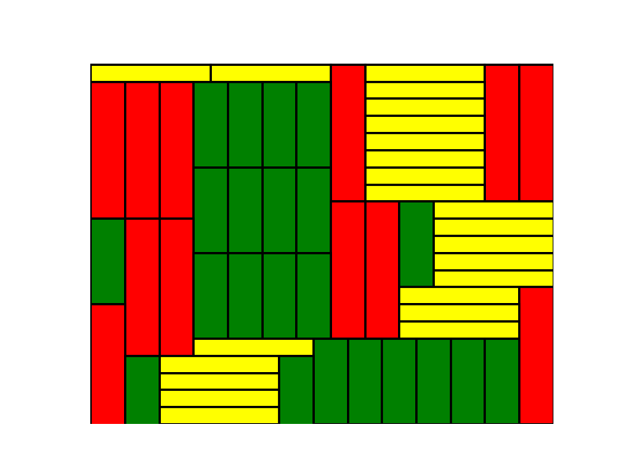

# Parkietaże

Kod żródłowy do artykułu o parkietażach znajduje się w pliku ``parkiet.py``.

Aby uruchomić przykłady potrzebny jest python ze python ze standardowymi pakietami. Można na przykład uzyć dystrybucji Anaconda https://www.anaconda.com/download.

Następnie należy zainstalować pakiet ``cvxpy``. Instrukcje znajdują się pod adresem http://www.cvxpy.org/install/index.html. Zwykle powinno wystarczyć:

```
conda install -c cvxgrp cvxpy
```

lub

```
pip install cvxpy
```

zależnie od środowiska.

# CVXPY

CVXPY jest pakietem do modelowania wypukłych i całkowitoliczbowych problemów optymalizacyjnych. W skrócie, możemy w nim wyrazić równania i nierówności liniowe w formie niemal identycznej ze sformułowaniem matematycznym. Na przykład wzór

```
\sum_{i=a}^b x_i = 1
```

przyjmuje postać

```
cvxpy.sum(x[a:b+1]) == 1
```

# Solver

CVXPY służy do modelowania problemów, ale ich nie rozwiązuje. Do tego potrzebny jest wyspecjalizowany solver. Podczas instalacji pakietu CVXPY powinno zostac zainstalowanych kilka darmowych solverów, np. ``ECOS``, ``ECOS_BB``, ``SCS``. W przykładach korzystamy z ``ECOS_BB``. Można też użyć oprogramowania komercyjnego, np. GUROBI, CPLEX, MOSEK (większość udostępnia np. licencje akademickie). Szczegóły na http://www.cvxpy.org/install/index.html

# Przykłady

(Uwaga, rozwiązywanie tych przykładów solverem ECOS_BB może chwilę trwać).

Certyfikat niemożności pokrycia prostokąta 15x15 klockami 1x8, 8x1, 1x11, 11x1:

```
 2.0 -1.0 -1.0  2.0 -1.0 -1.0  2.0 -2.0  2.0 -1.0 -1.0  2.0 -1.0 -1.0  2.0
-1.0  0.5  0.5 -1.0  0.5  0.5 -1.0  1.0 -1.0  0.5  0.5 -1.0  0.5  0.5 -1.0
-1.0  0.5  0.5 -1.0  0.5  0.5 -1.0  1.0 -1.0  0.5  0.5 -1.0  0.5  0.5 -1.0
 2.0 -1.0 -1.0  2.0 -1.0 -1.0  2.0 -2.0  2.0 -1.0 -1.0  2.0 -1.0 -1.0  2.0
-1.0  0.5  0.5 -1.0  0.5  0.5 -1.0  1.0 -1.0  0.5  0.5 -1.0  0.5  0.5 -1.0
-1.0  0.5  0.5 -1.0  0.5  0.5 -1.0  1.0 -1.0  0.5  0.5 -1.0  0.5  0.5 -1.0
 2.0 -1.0 -1.0  2.0 -1.0 -1.0  2.0 -2.0  2.0 -1.0 -1.0  2.0 -1.0 -1.0  2.0
-2.0  1.0  1.0 -2.0  1.0  1.0 -2.0  2.0 -2.0  1.0  1.0 -2.0  1.0  1.0 -2.0
 2.0 -1.0 -1.0  2.0 -1.0 -1.0  2.0 -2.0  2.0 -1.0 -1.0  2.0 -1.0 -1.0  2.0
-1.0  0.5  0.5 -1.0  0.5  0.5 -1.0  1.0 -1.0  0.5  0.5 -1.0  0.5  0.5 -1.0
-1.0  0.5  0.5 -1.0  0.5  0.5 -1.0  1.0 -1.0  0.5  0.5 -1.0  0.5  0.5 -1.0
 2.0 -1.0 -1.0  2.0 -1.0 -1.0  2.0 -2.0  2.0 -1.0 -1.0  2.0 -1.0 -1.0  2.0
-1.0  0.5  0.5 -1.0  0.5  0.5 -1.0  1.0 -1.0  0.5  0.5 -1.0  0.5  0.5 -1.0
-1.0  0.5  0.5 -1.0  0.5  0.5 -1.0  1.0 -1.0  0.5  0.5 -1.0  0.5  0.5 -1.0
 2.0 -1.0 -1.0  2.0 -1.0 -1.0  2.0 -2.0  2.0 -1.0 -1.0  2.0 -1.0 -1.0  2.0
```

Pokrycie prostokąta 22x27 klockami 8x2, 5x2, 1x7:



# Zadania

* Zmodyfikuj funkcję ``findCertificate`` tak, aby szukała certyfikatu zawierającego tylko liczby całkowite.
* Znajdź cerfyfikat zawierający tylko liczby całkowite i możliwie rzadki, tzn. zawierający jak najwięcej zer. (Ten i poprzedni problem prowadzą do problemów całkowitoliczbowych)
* Zmodyfikuj program tak, aby dopuścić klocki dowolnych kształtów (np. tetromina) a nie tylko prostokąty, a także aby cała plansza mogła mieć dowolny kształt.
* Napisz program rozwiązujący trójwymiarowe łamigłowki Kanoodle https://www.youtube.com/watch?v=P2qTSwl5oCc.
* Przypuśćmy, że tak jak w artykule mamy problem liniowy ze zmiennymi zerojedynkowymi. Może się zdarzyć, że po relaksacji problem ma rozwiązanie rzeczywiste (ale nie zerojedynkowe), czyli nadal nie wiemy, czy parkietaż istnieje. Możemy jednak rozważyć inne, silniejsze relaksacje! Zamiast pytania, czy dany układ ma rozwiązania rzeczywiste, możemy na przykład spytać czy istnieją rozwiązania:

  * rzeczywiste nieujemne,
  * w przedziale [0,1].

  W każdym z tych przypadków brak rozwiązania będzie wciąż oznaczał brak rozwiązania dla problemu zerojedynkowego. Jak wyglądają certyfikaty dla tych relaksacji? Napisz program, który je znajduje.