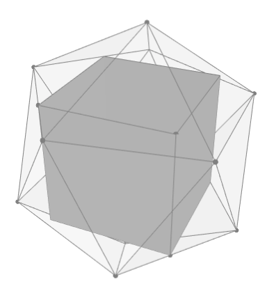

# Wielościany w wielościanach

Materiały do artykułu o zawieraniu wielościanów w Delcie.

# Przybliżone zawieranie

Obliczenia przeprowadzone w artykule dla wzajemnego zawierania różnych wielokątów/ścianów można znaleźć w pliku . Do jego uruchomienia potrzebny jest pakiet MOSEK http://www.mosek.com. Te same obliczenia można zaimplementować przy użyciu dowolnego pakietu udostępniejącego programowanie liniowe (linear programming), na przykład CVXPY z solverem ECOS (po szczegóły zob. https://github.com/aszek/Delta/tree/master/parkietaze).

# Dokładne zawieranie

Dokładne obliczenia zawarte w końcowej części artykułu mozna przeprowadzić używając pakietu SAGE: https://www.sagemath.org/. Można go też uruchomic w wersji online: https://cocalc.com/. Kod źródłowy znajduje się w pliku . Można go użyć do przeprowadzenia podobnych obliczeń dla zawierania innych par wielościanów.

